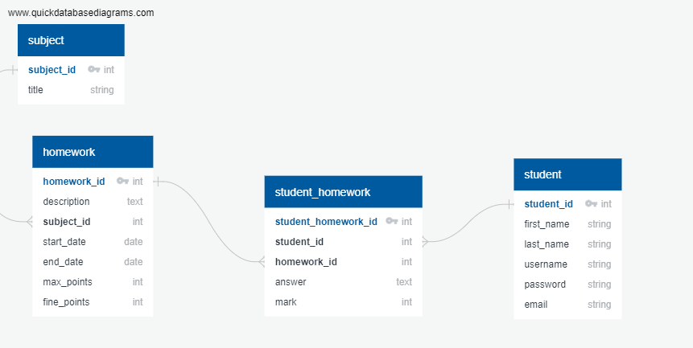

# models
## Схема БД

## Student
Расширение пользователя, отражающее студента
```python
class Student(AbstractUser):
    homeworks = models.ManyToManyField('Homework', related_name='students')

    def __str__(self):
        return self.username
```

## Subject
Предмет
```python
class Subject(models.Model):
    title = models.CharField(max_length=100, blank=False)

    def __str__(self):
        return self.title
```

## Homework
Домашнее задание
```python
class Homework(models.Model):
    subject = models.ForeignKey(
        'Subject',
        related_name='homeworks',
        on_delete=models.RESTRICT
    )
    start_date = models.DateField()
    end_date = models.DateField()
    max_points = models.IntegerField(validators=[validators.MinValueValidator(0, message='less than 0')])
    fine_points = models.IntegerField(validators=[validators.MinValueValidator(0, message='less than 0')])
    description = models.TextField()

    def __str__(self):
        return f'Предмет: {self.subject} Дата выдачи: {self.start_date}'
```

## StudentHomework 
Домашнее задание, выданное студенту
```python
class StudentHomework(models.Model):
    student = models.ForeignKey('Student', on_delete=models.RESTRICT, related_name='assigned_homeworks')
    homework = models.ForeignKey('Homework', on_delete=models.RESTRICT, related_name='assigned_homeworks')
    answer = models.TextField(blank=True, null=True)
    mark = models.IntegerField(blank=True, null=True)

    def __str__(self):
        return f'{self.student}: {self.homework}'

    def get_submit_url(self):
        return reverse('homework:submit_homework', kwargs={'pk': self.pk})
```